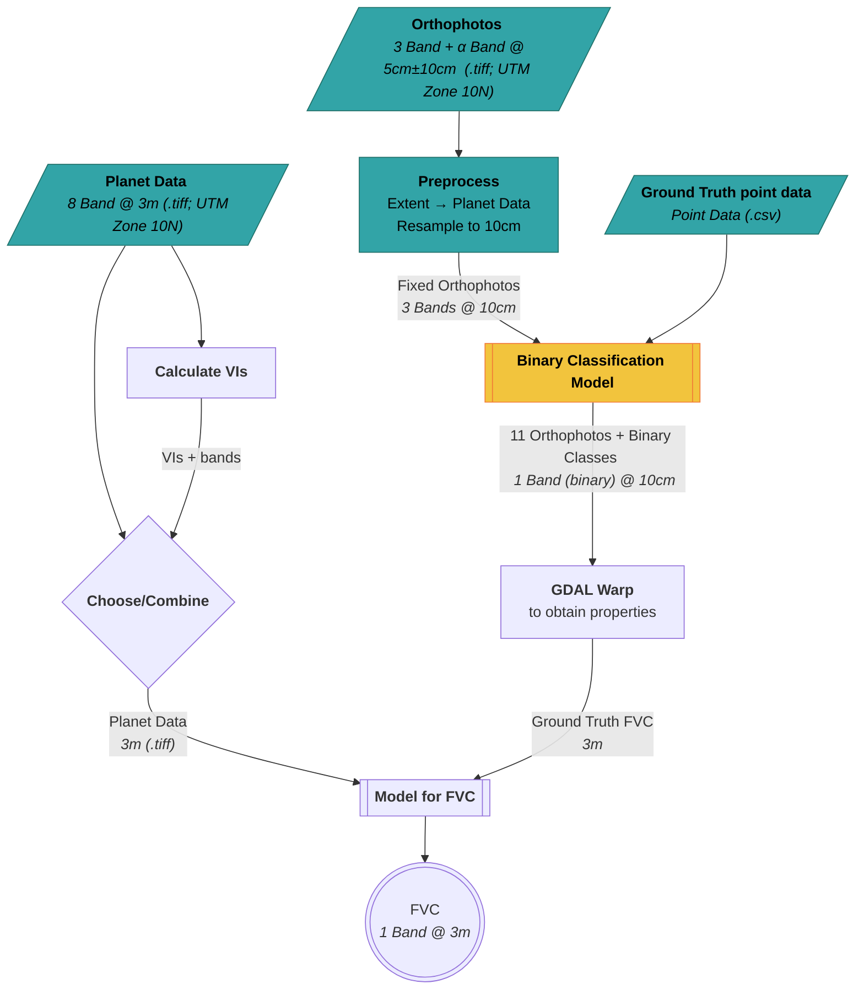

# FracVeg292
Fractional vegetation cover project for Machine Learning 292

## Project Overview

Key:
- Green: Done
- Orange/Yellow: In Progress
- Default: To Do

```mermaid
flowchart TD
    GT[/"<b>Ground Truth point data</b> <br/> <i>Point Data (.csv)</i>"/]
    OP[/"<b>Orthophotos</b> <br/> <i>3 Band + α Band @ 5cm±10cm  (.tiff; UTM Zone 10N)</i>"/]
    PD[/"<b>Planet Data</b> <br/> <i>8 Band @ 3m (.tiff; UTM Zone 10N)</i>"/]

    PPR["<b>Preprocess</b> <br/> Extent → Planet Data <br/> Resample to 10cm"]
    BNC[[<b>Binary Classification Model</b>]]
    GDLW[<b>GDAL Warp</b> <br/> to obtain properties]
    VIS[<b>Calculate VIs</b>]
    MFVC[[<b>Model for FVC</b>]]
    CHOOSE{<b>Choose/Combine</b>}

    FVC((("FVC <br> <i>1 Band @ 3m</i>")))

    PD -->VIS
    PD -->CHOOSE
    VIS -->|"VIs + bands"|CHOOSE
    CHOOSE -->|"Planet Data <br/> <i>3m (.tiff)</i>"|MFVC


    OP -->PPR
    PPR -->|"Fixed Orthophotos <br/> <i>3 Bands @ 10cm</i>"|BNC
    BNC -->|"11 Orthophotos + Binary Classes <br> <i>1 Band (binary) @ 10cm</i> "|GDLW
    GDLW -->|Ground Truth FVC <br/> <i>3m</i>|MFVC
    MFVC -->FVC

    GT -->BNC

    style OP fill:#32a4a7,stroke:#1e7069,color:#000
    style PD fill:#32a4a7,stroke:#1e7069,color:#000
    style GT fill:#32a4a7,stroke:#1e7069,color:#000

    style PPR fill:#32a4a7,stroke:#1e7069,color:#000

    style BNC fill:#f2c43d,stroke:#f17c37,color:#000
```